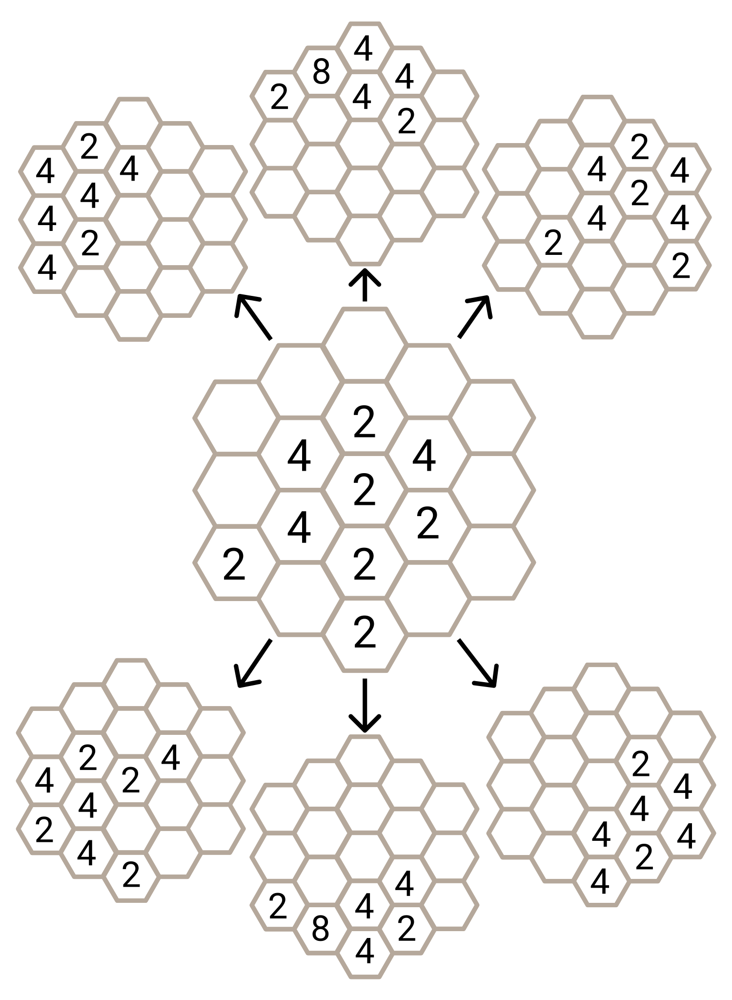
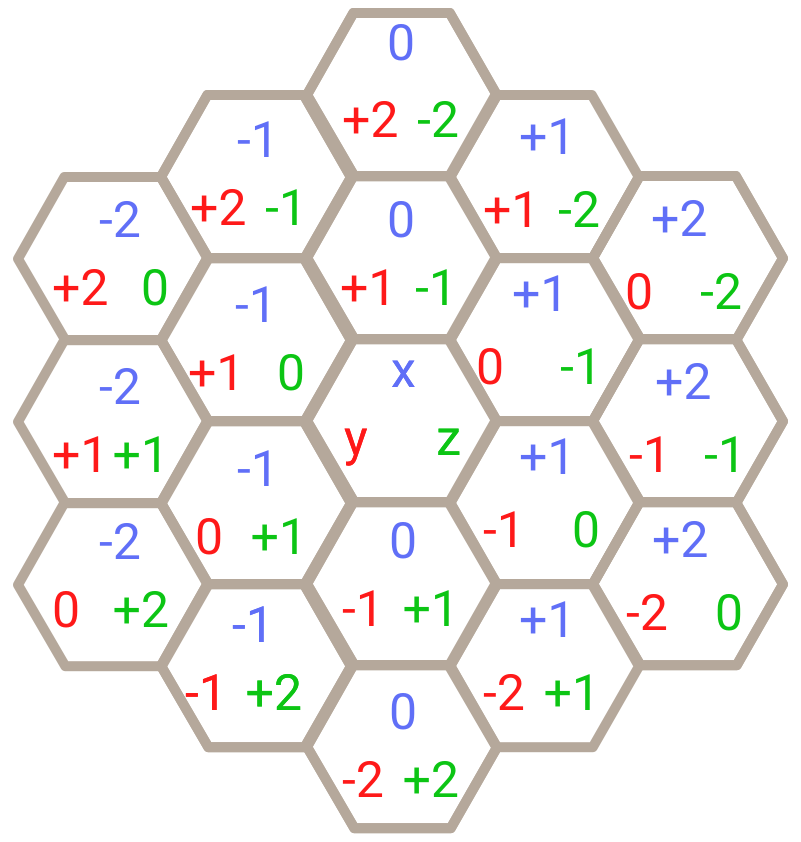

# My Game
A ready-made solution on surge.sh =>  [My game](https://hex2048-disillusioned-pencil.surge.sh/)


# Hexagonal 2048

## Task description

Your task is to develop a game [2048](https://play2048.co/) on a hexagonal field.
Please take a look at our example: [hexagonal 2048](https://hex2048.surge.sh/).

What is required:
- Have to render a hexagonal game field with hexagons according to the game size.
- Required game size is 2. The supporting of other game levels (3, 4, and more) is highly appreciated but NOT REQUIRED.
- Have to receive data from the [server](#receiving-data-from-the-deployed-server) and render them correctly.
- Have to handle appropriate keyboard keys according to the [rules](#directions-and-keys).
- Have to change field data by clicking keyboard keys according to the [rules](#shifting-rules).
- Deploy your implementation on the [surge.sh](http://surge.sh).
- Have to work on the latest Google Chrome on the desktop (all other devices and browsers are up to you).
- Have to setup game via [urlSearchParams](#search-params).
- All other ideas, game features and controls, supported devices, and so on are optional.

Nice to have:
- Several game levels (at least 3 and 4) ([example](https://hex2048.surge.sh/?hostname=hex2048szb9jquj-hex15.functions.fnc.fr-par.scw.cloud&port=80&radius=4)).

More info:
- **Useful article about hexagons:
  [Hexagonal Grids](https://www.redblobgames.com/grids/hexagons/).**
- The visual game appearance and technologies to implement the task are up to you and are restricted only to your imagination.
- Animations are appreciated but not required.

## Rules

### Game initialization

When the game starts on any game level, the user should not interact with UI. 
That means when you choose the game level or the game is loaded, the game should be initialized on its own by default,
and the user has to see the beginning numbers to start playing.

The same rule is applicable when the game is loaded by the URL for [tests purposes](#how-will-your-solution-be-tested). 
When the game is loaded using URL parameters, then the first request has to be done immediately after loading without any additional actions. 
And as a result, you will be able to see the beginning numbers to start playing.

In other words, before starting playing the user should already see some beginning numbers received from the server without any actions. 
The first request to the server has to be done automatically after starting the game.

### Directions and Keys

You have 6 keyboard keys (Latin lower case letters) for 6 existing directions:

| Direction                 | Keyboard key |
| ------------------------- | :----------: |
| north (top)               |      w       |
| north-east (top-right)    |      e       |
| north-west (top-left)     |      q       |
| south (bottom)            |      s       |
| south-east (bottom-right) |      d       |
| south-west (bottom-left)  |      a       |

After pressing any of the listed keys, all your numbers should be shifted in the chosen direction.

### Shifting rules

Shifting works according to common [2048](https://play2048.co/) rules [EN](<https://en.wikipedia.org/wiki/2048_(video_game)>)) taking into account
appropriate hexagonal direction.

| before shift → |   after |
| -------------: | ------: |
|            2 2 |       4 |
|          2 2 2 |     2 4 |
|          2 2 4 |     4 4 |
|          4 2 2 |     4 4 |
|        2 4 2 4 | 2 4 2 4 |
|        2 2 4 4 |     4 8 |



After each shift, you need to place new numbers received from the [server](#rng-server).

In case if after starting shifting there are no movements done in the chosen direction and there are possible movements at least in one direction ([game status](#game-status) is `playing`). 
Nothing should be done until shifting is completed - do not need to add new numbers. 
The game has to wait for changes in any direction if they are possible and has not been done during shifting.

### Game status

The user should know the current game status.

Possible game statuses:
- `playing` - there are possible moves that can be done.
- `game-over` - there are no more possible moves.

Game status should be present somewhere in your game DOM element (any one DOM element at the any place of DOM) as a data attribute `data-status`. 

Example:
```html
<div>Game Status: <span data-status="playing">playing</span></div>
```

## RNG Server

## Receiving data from the deployed server

For game purposes, we have a [random number generator](https://en.wikipedia.org/wiki/Random_number_generation)
(RNG) the server that generates random numbers into random places for your field.

The server expects you to send a POST request with the correct body and pathname in
the URL. The body has to be an array of non-empty cells (the number should be 2 and
more) of your field. Cells’ order doesn't matter. A cell is an object which is a
representation of [cube coordinates](https://www.redblobgames.com/grids/hexagons/#coordinates-cube).

For example:
```js
const cell = {
  x: 0,
  y: 1,
  z: -1,
  value: 2,
};
```

The server responds with an array of the
[cube coordinates](https://www.redblobgames.com/grids/hexagons/#coordinates-cube)
cells that you need to add to your field. One or several cells can be returned.
The servers send an empty array in case of no more positions to add new numbers.
`x`, `y`, `z` - these are positions for new numbers. `value` is a number to add at that position.



The server expects you to send the radius (game level) in the URL pathname
(e.g., `/2` for 2, `/3` for 3, etc.). 
For example, correct server URL for game radius 2 is `//hex2048-lambda.octa.wtf/2`.

Server URL: `hex2048-lambda.octa.wtf` (works with both HTTP and HTTPS).

Example (initial game):
```bash
curl -d '[]' \
     -X POST hex2048-lambda.octa.wtf/2
```

> For Windows you will need something like [this](https://curl.se/windows/)

```bash
curl -d '[]' \
     -X POST https://hex2048-lambda.octa.wtf/2
```

Server response:
```
[
  { "x": 0, "y": 1, "z": -1, "value": 2},
  { "x": 1, "y": 0, "z": -1, "value": 2},
  { "x": 1, "y": -1, "z":  0, "value": 2}
]
```

Example with payload (filled cells):
```bash
curl -d '[{"x": 0, "y": 0, "z": 0, "value": 2}]' \
     -X POST http://hex2048-lambda.octa.wtf/2
```

Or

```bash
curl -d '[{"x": 0, "y": 0, "z": 0, "value": 2}]' \
     -X POST https://hex2048-lambda.octa.wtf/2
```

Server response:
```
[ { "x": 1, "y": -1, "z": 0, "value": 2 } ]
```

### Receiving data from the local server

To start the server locally you should install dependencies and run a test server. 

Steps to help:
```
npm install
npm run rng-server
```

Server URL: `http://localhost:13337`.

Example:
```bash
curl -d '[{"x": 0, "y": 0, "z": 0, "value": 2}]' \
     -X POST http://localhost:13337/2
```

Server response:
```
[ { "x": 1, "y": -1, "z": 0, "value": 2 } ]
```

### Search params

The game should have the ability to be set up via searchParams. Required params are:

- `hostname` - this parameter sets hostname for rng-server.
- `port` - optional parameter. If it is not set to default port is 80 otherwise your game should use this port for rng-server.
- `radius` - radius for the game.

You don't need to implement [wizard form](https://hex2048.surge.sh/) but it can help you during developing the game.

Tests are using these parameters to set up your game for test running.

## How will your solution be tested?

### Data attributes for hexagons

Every cell from the field should have appropriate data attributes: `data-x`,
`data-y`, `data-z` and `data-value`. Where `data-x`, `data-y`, `data-z` are
respective representations of cube coordinates `x`, `y`, `z`. And `data-value`
is number into this cell (e.g., 2, 4, 8, etc., or 0 if there is no number yet).

Example:
```html
<div data-x="1" data-y="-1" data-z="0" data-value="8">8</div>
<div data-x="1" data-y="-1" data-z="0" data-value="0"></div>
```

The element in the DOM with a unique combination of `data-x`, `data-y`, `data-z`
has to be a single one and has to have appropriate `data-value`. That means you
should not have more than one element in the DOM with the same values of `data-x`,
`data-y`, `data-z`. Otherwise, tests cannot handle this properly.

### Data attribute to recognize the game status

Do not forget to add `data-status` attribute. [Read more](#game-status)

### Run tests locally

To run tests locally you should run tests. Steps to help:
```
npm install
npm run test:local
```

By default, the server connects to `http://localhost:8080` in order to open the
game but you can change this behavior by passing `url` parameter. Example:
```
npm run test:local -- --url=http://localhost:3000
```

Please run tests for your deployed game and check that all work properly.
```
npm run test:local -- --url=http://hex2048.surge.sh
```

## Grading Notes

For extra credits, you should the following (one or more):

- Support radiuses more than 2 (at least 3, 4, and even more)
- Cover your code base with unit tests (with common sense of course)
- Implement animations

## Implementation details

You can use TypeScript or JavaScript this decision is up to you. 
If you want to use JavaScript, you should use `.jsx` extension, and `.tsx` extension for TypeScript.

If you don't like React, you can remove `ReactDOM.render` from `src/index.js` and implement your game with plain JavaScript/TypeScript.

We use `Create-React-App` template which brings a number of limitations in the choice of other technologies, 
but if you want and are able to use another library, we won't mind.

## Package scripts description

* `npm run start` - starts dev server with your game. The page will be reloaded on each code update.
* `npm run build` - builds the production version of your game. This command is used for tests.
* `npm run start-server` - starts rng-server locally.
* `npm run test:unit` - starts unit tests from `/src` folder. You can use it for your own tests.
* `npm run test:local` - starts our tests for your game. This command expects that dev-server with the game is launched and local rng-server not. These tests use [puppeteer](https://github.com/puppeteer/puppeteer) for tests your game in a browser. You are able to see how tests run in the browser for your game with this command.
* `npm run test` - starts production tests. This command use port 3000, so please leave it free if you try to use this command. The production tests also use [puppeteer](https://github.com/puppeteer/puppeteer).

## Tests requirements

The [tests/\*](tests/) files should not be modified. 
If you would like to add your own unit tests, you can add these in a separate file in the `src` folder.

The `package.json` file should only be modified in order to add any third-party dependencies required for your solution. 
The jest and babel versions should not be changed.

Your solution must use/be compatible with Node.js version **15.5.1**.

## Tests

*Note: The tests were written using [puppeteer](https://github.com/puppeteer/puppeteer) library. (We haven't used cypress in tests)*

Run `npm install` to install all dependencies and then run `npm run test` to run tests. 
These should all pass if your solution has been implemented correctly.

Good luck!

## License

At CodeScreen, we strongly value the integrity and privacy of our assessments. As a result, this repository is under exclusive copyright, which means you **do not** have permission to share your solution to this test publicly (i.e., inside a public GitHub/GitLab repo, on Reddit, etc.). <br>

## Submitting your solution

Please push your changes to the `main branch` of this repository. You can push one or more commits. <br>

Once you are finished with the task, please click the `Submit Solution` link on <a href="https://app.codescreen.com/candidate/6384777e5986e10ffcd98888" target="_blank">this screen</a>.